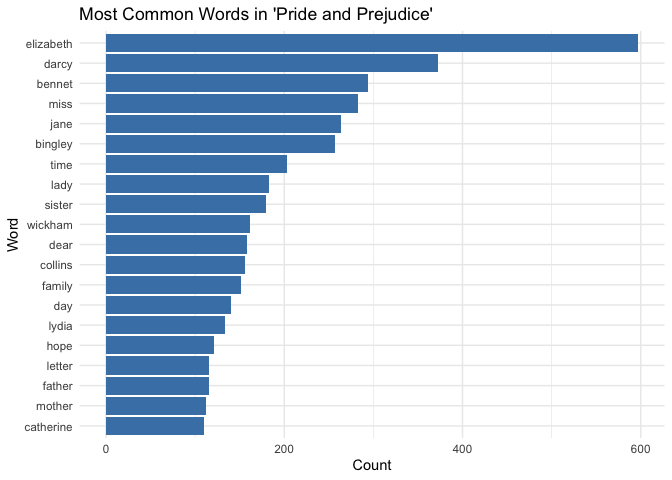

Assignment B4
================
2024-12-02

# Assignment B4: Option 1

## Libraries

First, I load the necessary libraries.

``` r
library(janeaustenr)
library(tidytext) 
library(tidyverse)
library(testthat)
```

## Exercise 1

### Introduction

In this exercise, I analyze a Jane Austen book to visualize the most
common words. I use the `janeaustenr` package to access the book,
`tidytext` for text mining, and `ggplot2` for data visualization.

### Data selection

I use the `janeaustenr` package to extract the text of *Pride and
Prejudice*.

``` r
# Extract the book
book <- janeaustenr::austen_books() %>%
  filter(book == "Pride & Prejudice")

# Display the first few rows of the book
head(book)
```

    ## # A tibble: 6 × 2
    ##   text                  book             
    ##   <chr>                 <fct>            
    ## 1 "PRIDE AND PREJUDICE" Pride & Prejudice
    ## 2 ""                    Pride & Prejudice
    ## 3 "By Jane Austen"      Pride & Prejudice
    ## 4 ""                    Pride & Prejudice
    ## 5 ""                    Pride & Prejudice
    ## 6 ""                    Pride & Prejudice

### Text tokenization and stopword removal

I tokenize the text into individual words and remove common stopwords
using the `tidytext::stop_words` dataset.

``` r
# Tokenize and remove stopwords
tidy_book <- book %>%
  unnest_tokens(word, text) %>%
  anti_join(stop_words, by = "word")

# Display the first few rows of the tidy data
head(tidy_book)
```

    ## # A tibble: 6 × 2
    ##   book              word     
    ##   <fct>             <chr>    
    ## 1 Pride & Prejudice pride    
    ## 2 Pride & Prejudice prejudice
    ## 3 Pride & Prejudice jane     
    ## 4 Pride & Prejudice austen   
    ## 5 Pride & Prejudice chapter  
    ## 6 Pride & Prejudice 1

### Word Frequency Analysis

I count the occurrences of each word to identify the most common ones.

``` r
# Count word frequencies
word_counts <- tidy_book %>%
  count(word, sort = TRUE)

# Display the top 10 most common words
head(word_counts, 10)
```

    ## # A tibble: 10 × 2
    ##    word          n
    ##    <chr>     <int>
    ##  1 elizabeth   597
    ##  2 darcy       373
    ##  3 bennet      294
    ##  4 miss        283
    ##  5 jane        264
    ##  6 bingley     257
    ##  7 time        203
    ##  8 lady        183
    ##  9 sister      180
    ## 10 wickham     162

### Visualization of Common Words

I plot a bar chart of the top 20 most common words.

``` r
# Plot the most common words
word_counts %>%
  slice_max(n, n = 20) %>%
  ggplot(aes(x = reorder(word, n), y = n)) +
  geom_col(fill = "steelblue") +
  coord_flip() +
  labs(
    title = "Most Common Words in 'Pride and Prejudice'",
    x = "Word",
    y = "Count"
  ) +
  theme_minimal()
```

<!-- -->

### Summary

This analysis demonstrates the use of text mining techniques to extract
insights from literary texts. By tokenizing the text and removing
stopwords, I focus on words that carry significant meaning and visualize
their frequencies effectively.

## Exercise 2

### Introduction

In this exercise, I create a custom Pig Latin function. The function
includes:

1.  A rearrangement rule for modifying the letters in the word.

2.  An addition rule for appending specific characters to the word.

### Function Implementation

Here is the Pig Latin function with modified rules. The rearrangement
moves the first two letters to the end (if available), and the addition
appends “yay” to the word.

``` r
#' Convert a word to Pig Latin
#'
#' @param word A character string representing the input word.
#' @return A character string representing the word in Pig Latin.
#' @examples
#' convert_to_piglatin("hello")
#' convert_to_piglatin("example")
convert_to_piglatin <- function(word) {
  # Input validation
  if (!is.character(word) || length(word) != 1) {
    stop("Input must be a single word as a character string.")
  }
  
  # Convert to lowercase
  word <- tolower(word)
  
  # Rearrangement rule: Move the first two letters to the end (if possible)
  if (nchar(word) > 2) {
    rearranged <- paste0(substr(word, 3, nchar(word)), substr(word, 1, 2))
  } else {
    rearranged <- word
  }
  
  # Addition rule: Append "yay" to the word
  piglatin <- paste0(rearranged, "yay")
  
  return(piglatin)
}
```

### Examples

I apply the function to some sample words.

``` r
# Examples of Pig Latin conversion
convert_to_piglatin("hello")    # Expected output: "lloheyay"
```

    ## [1] "lloheyay"

``` r
convert_to_piglatin("world")    # Expected output: "rldwoyay"
```

    ## [1] "rldwoyay"

``` r
convert_to_piglatin("hi")       # Expected output: "hiyay"
```

    ## [1] "hiyay"

### Testing

I perform at least three tests for the function using the `testthat`
package.

``` r
test_that("Pig Latin conversion works correctly", {
expect_equal(convert_to_piglatin("Dorna"), "rnadoyay")  # Moves first two letters "Do" to the end
  expect_equal(convert_to_piglatin("stats"), "atsstyay") # Moves "st" to the end
  expect_equal(convert_to_piglatin("UBC"), "cubyay")      # Handles uppercase input and moves "UB" to the end
  expect_equal(convert_to_piglatin("hi"), "hiyay")
  expect_error(convert_to_piglatin(123), "Input must be a single word as a character string.")
  expect_error(convert_to_piglatin(c("hello", "world")), "Input must be a single word as a character string.")
})
```

    ## Test passed 🌈

### Summary

This exercise demonstrates the use of functional programming in R to
create a customized Pig Latin conversion function.
